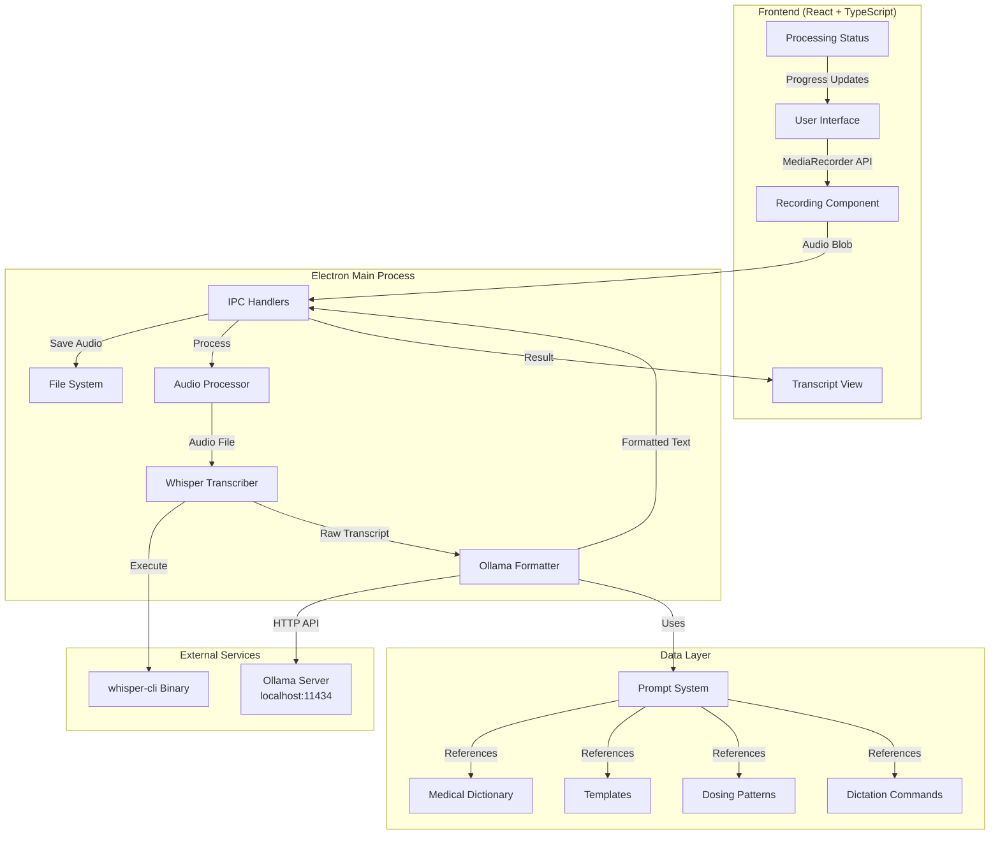
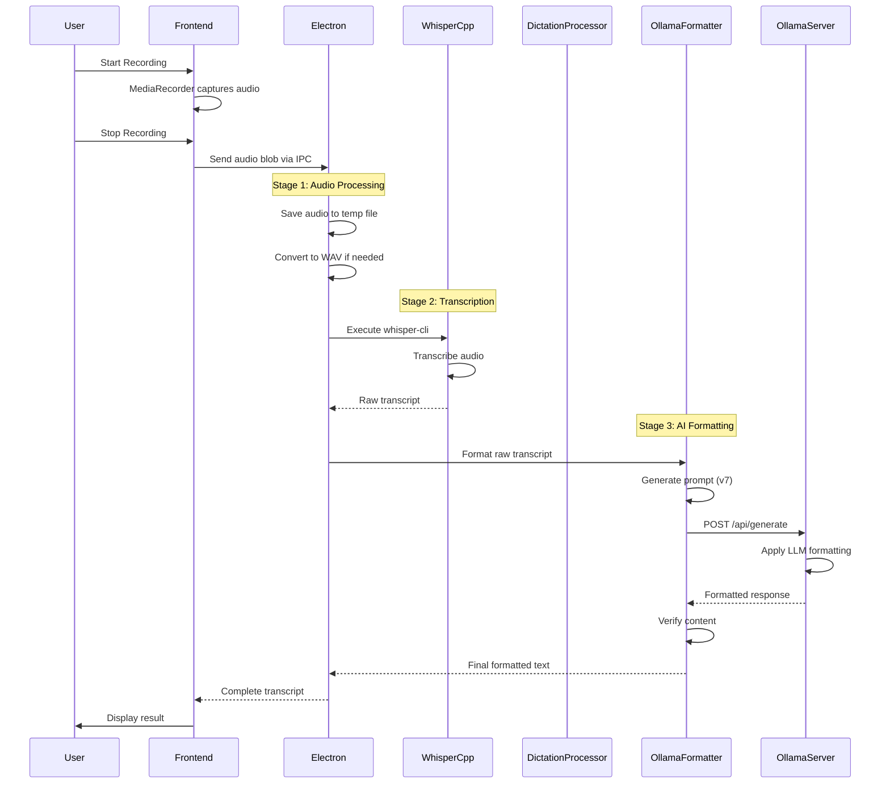
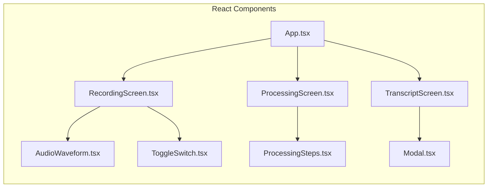
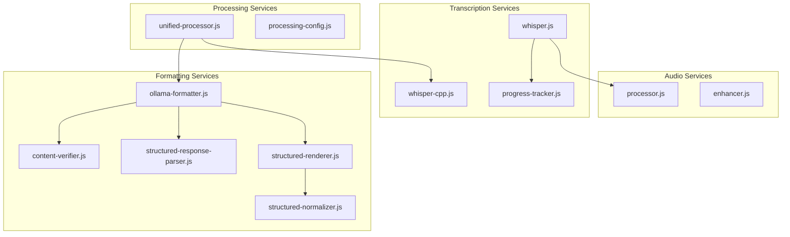
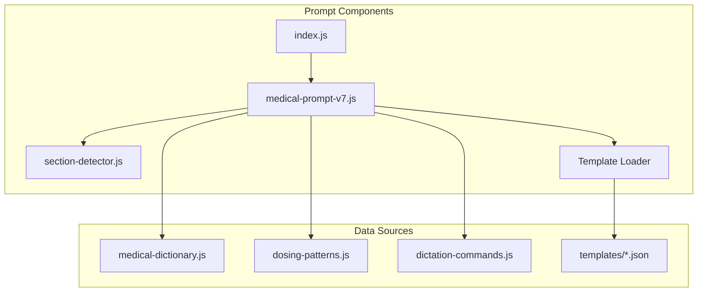
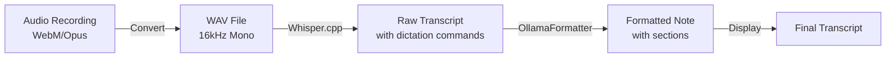
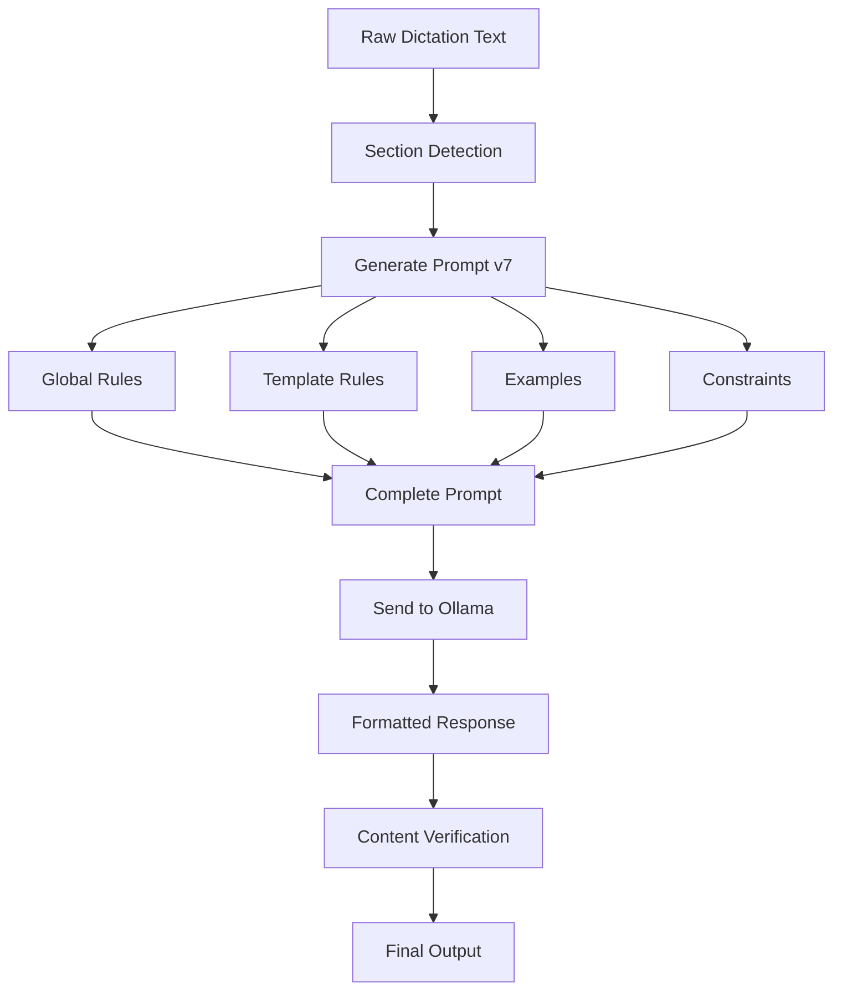
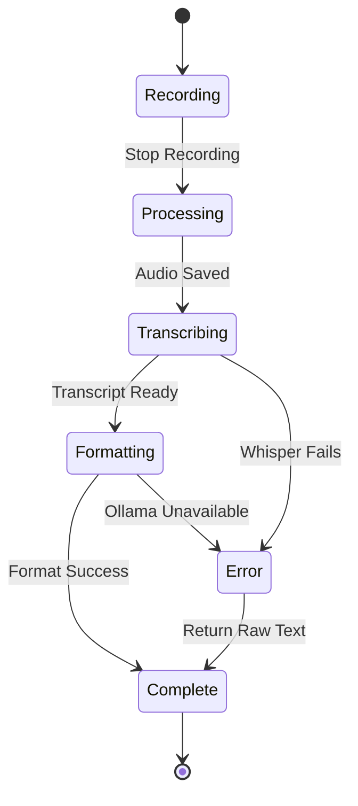

# DoctorDictate System Architecture

## Overview

DoctorDictate is a privacy-focused medical transcription application that processes audio recordings locally using Whisper for transcription and Ollama for formatting. The system follows a multi-stage pipeline architecture with clear separation of concerns.

## High-Level Architecture



## Processing Pipeline



## Component Architecture

### 1. Frontend Layer (`/src/components/`)



### 2. Service Layer (`/src/services/`)



### 3. Prompt System (`/src/prompts/`)



## Data Flow

### Recording to Transcription Flow



### Prompt Generation Flow



### Structured Formatting Flow (v7+)

```mermaid
flowchart LR
    Manifest[Section Manifest
(SectionDetector + template)] --> PromptGen[MedicalPromptV7
JSON contract]
    PromptGen --> OllamaJSON[Ollama JSON response]
    OllamaJSON --> Parser[structured-response-parser]
    Parser --> Renderer[structured-renderer]
    Renderer --> Normalizer[structured-normalizer]
    Normalizer --> Markdown[Deterministic Markdown]
    Markdown --> Verifier[ContentVerifier.verifyStructuredNote]
    Verifier --> Result[Verified Output + Report]
```

Formatter logs capture manifest headers, JSON parsing success/failure, deterministic rendering summaries, and verification reports so content gaps are visible during development and support sessions.

## API Interactions

### Ollama API

**Endpoint**: `http://localhost:11434/api/generate`

**Request**:
```json
{
  "model": "llama3.2:latest",
  "prompt": "<<generated prompt from medical-prompt-v7>>",
  "stream": false,
  "options": {
    "temperature": 0.1,
    "num_predict": 4000,
    "num_ctx": 32768
  }
}
```

**Response**:
```json
{
  "response": "<<formatted medical note>>",
  "done": true
}
```

### IPC Communication

**Main Process Handlers** (`main.js`):
- `save-audio-blob`: Save recorded audio
- `transcribe-audio`: Start transcription pipeline
- `set-whisper-model`: Change accuracy level
- `save-transcript`: Export to file system
- `export-pdf`: Generate PDF output

**Renderer → Main**:
```javascript
window.electronAPI.transcribeAudio(filePath)
```

**Main → Renderer**:
```javascript
event.sender.send('transcription-progress', progress)
```

## Configuration

### Processing Modes

```javascript
// processing-config.js
{
  FAST: {
    whisperModel: 'tiny.en',
    ollamaModel: 'llama3.2:3b',
    temperature: 0.1
  },
  ACCURATE: {
    whisperModel: 'small.en',
    ollamaModel: 'llama3.2:latest',
    temperature: 0.1
  }
}
```

### Template Structure

```json
// templates/format/medicine-management.json
{
  "sections": [...],
  "formatting": {
    "medicationFormat": "{Name} {Dosage} ({Frequency})",
    "problemFormat": "{Diagnosis} – {status}",
    "sectionHeaderPrefix": "###"
  },
  "templateSpecificRules": [...]
}
```

Optional sections mark `"autoFill": false` to ensure the formatter never emits default prose when the clinician omits that section in the dictation.

## Error Handling



## Security Considerations

1. **Local Processing**: All audio processing happens locally
2. **No External APIs**: Whisper and Ollama run on localhost
3. **Temporary Files**: Audio files are cleaned up after processing
4. **Content Isolation**: Electron context isolation enabled
5. **Medical Data**: Never leaves the user's machine

## Performance Optimizations

1. **Chunked Transcription**: Long audio split into 30-second chunks
2. **Model Selection**: Auto-select based on file size
3. **Progress Tracking**: Real-time updates during processing
4. **Caching**: Ollama model kept in memory
5. **Parallel Processing**: Where possible (future enhancement)

## File Structure

```
src/
├── components/          # React UI components
├── services/           # Business logic
│   ├── audio/         # Audio processing
│   ├── transcription/ # Whisper integration
│   ├── formatting/    # Ollama integration
│   └── processing/    # Unified pipeline
├── prompts/           # Prompt generation system
├── data/              # Static data files
│   ├── medical-dictionary.js
│   ├── dosing-patterns.js
│   └── dictation-commands.js
├── templates/         # Medical note templates
├── hooks/            # React hooks
├── utils/            # Utility functions
└── __tests__/        # Test files
```

## Testing Strategy

### Unit Tests
- Component rendering tests
- Service function tests
- Prompt generation tests

### Integration Tests
- End-to-end pipeline tests
- Whisper → Ollama flow
- Template application

### Manual Testing
- Real audio recordings
- Various medical scenarios
- Edge cases (unclear speech, background noise)

## Future Enhancements

1. **Multi-language Support**: Extend beyond English
2. **Custom Templates**: User-defined note formats
3. **Cloud Backup**: Optional encrypted backup
4. **Voice Commands**: Control recording with voice
5. **Real-time Transcription**: Stream processing
6. **Mobile App**: iOS/Android versions
7. **Practice Mode**: Training for dictation
8. **Analytics**: Usage patterns (local only)

## Dependencies

### Core Dependencies
- **Electron**: Desktop application framework
- **React**: UI framework
- **TypeScript**: Type safety
- **whisper-cli**: Local transcription (Whisper.cpp)
- **Ollama**: Local LLM formatting

### Key Libraries
- **pdfkit**: PDF generation
- **tailwindcss**: Styling
- **lucide-react**: Icons
- **react-markdown**: Markdown rendering

## Deployment

### Build Process
```bash
npm run build        # Build React app
npm run build:electron # Build Electron app
npm run dist        # Package for distribution
```

### Platform Packages
- **macOS**: .dmg, .app
- **Windows**: .exe installer
- **Linux**: .AppImage, .deb

## Monitoring & Debugging

### Debug Tools
- Chrome DevTools (in development)
- Console logging with categories
- Progress tracking for long operations
- Error boundaries in React

### Performance Metrics
- Transcription time per minute of audio
- Formatting response time
- Memory usage during processing
- Model loading time

---

## Related Documentation

- [`/docs/design/rework-processing.md`](./rework-processing.md) - Detailed processing pipeline
- [`/docs/design/fast-processing-strategy.md`](./fast-processing-strategy.md) - Performance optimizations
- [`/docs/design/user-journey.md`](./user-journey.md) - User experience flow
- [`/CLAUDE.md`](../../CLAUDE.md) - Development guidelines
- [`/tech-stack.md`](../../tech-stack.md) - Technology choices
